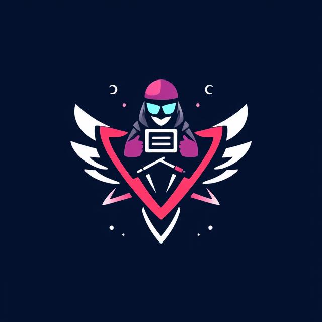

# Utsav - Event Management System 🎉



**UTSAV** is a modern, full-stack web application designed to streamline the planning, management, and participation of events in academic institutions and beyond. Built with React, Firebase, and Tailwind CSS, UTSAV provides a centralized platform for organizers and participants to engage seamlessly in events of all scales.

🚀 **Live Demo**: [utsav-ems.web.app](https://utsav-ems.web.app)

---

## 📌 Features

### 🧑‍💼 For Organizers
- Create and customize events with details (venue, time, slots, etc.)
- View list of registered participants
- Real-time update and dashboard analytics
- Manage and edit active or upcoming events

### 🧑‍🎓 For Participants
- Browse upcoming events
- One-click event registration
- Receive updates and notifications
- Digital ticketing and confirmation

### 🔐 System Highlights
- Secure login via Firebase Authentication
- Real-time database with Firestore
- Responsive UI with Tailwind CSS
- Role-based access (Admin, Organizer, Participant)

---

## 🛠️ Tech Stack

| Frontend | Backend | Database | Styling | Hosting |
|----------|---------|----------|---------|---------|
| ReactJS (Vite) | Firebase Auth | Firestore | TailwindCSS, Bootstrap | Firebase Hosting |

---

## 📸 Screenshots

| Login | Organizer Dashboard | Event Page |
|-------|----------------------|------------|
|  |  |  |

## 🚀 Getting Started

### 1. Clone the repository

```bash
git clone https://github.com/Utsava-v1/Utsava-nie-v1/
cd utsav-ems
```

### 2. Install dependencies

```bash
npm install
```

### 3. Setup Firebase

* Create a Firebase project at [Firebase Console](https://console.firebase.google.com/)
* Enable **Authentication** and **Firestore Database**
* Replace your Firebase config in `src/firebase.js`

### 4. Start the development server

```bash
npm run dev
```

---

## 🌐 Deployment

This app is already deployed at:
🔗 [https://utsav-ems.web.app](https://utsav-ems.web.app)

To redeploy:

```bash
npm run build
firebase deploy
```

---

## 📌 Future Enhancements

* Mobile App (React Native / Flutter)
* QR Code based event check-ins
* Real-time chat for participants & organizers
* AI-based personalized event recommendations
* Event calendar sync and map integrations

---

## 🤝 Contributors

* **Shubham Kumar Singh** [@Shubham-404](https://github.com/Shubham-404/)
* **Sinchana V** [@sinch1717](https://github.com/sinch1717)
* **Sree Dharshan K S** [@Sree Dharshan KS LinkedIn]([https://github.com/sree-darshan](https://www.linkedin.com/in/sree-dharshan-20b19a296/))
* Guided by **Mrs. Usha K Patil** and **Mrs. Rakshitha M** -Assistant Professor at NIE, Mysuru

---

## 📃 License

This project is licensed under the [MIT License](LICENSE).

---

> Built with ❤️ at The National Institute of Engineering, Mysuru – 2024-25
